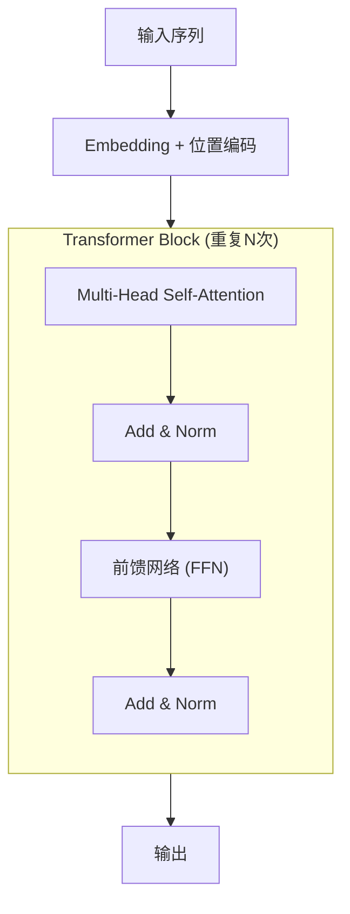
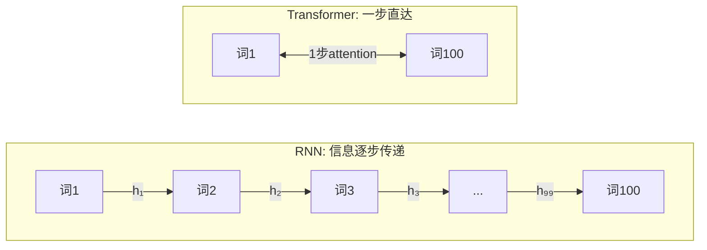

> 2017 年，有人写了一篇论文，标题的意思是"你只需要注意力"。事实证明这不是吹牛——这篇论文的架构成为了之后所有大模型的基石。

## 一个大胆的赌注

上一篇我们看到 attention 被加到了 RNN 上——编码器是 RNN，解码器也是 RNN，attention 作为它们之间的桥梁。效果很好。

但 RNN 本身有一个根深蒂固的问题：**它必须一步一步来**。

想象一条流水线工厂只有一个工位。不管你有多少订单，每次只能处理一个。读一个 100 词的句子，RNN 需要走 100 步——第 2 步依赖第 1 步的结果，第 3 步依赖第 2 步……无法并行。

这在 2017 年成了大问题。GPU 的威力在于**并行计算**——它有成千上万个计算核心，可以同时工作。但 RNN 的顺序依赖让这些核心大部分时间都在闲着等。训练一个大型翻译模型需要好几周。

Google 的 Vaswani 等人想：attention 已经可以让任意两个位置直接通信，那 RNN 那个"一步一步走"的设计还有必要吗？

他们的答案是：**没必要。全部扔掉。只保留 attention。**

## Transformer：只用 Attention 构建的模型

他们提出的架构叫 Transformer。让我们看看它怎么工作——但先不急看公式，先理解直觉。

### Self-Attention：每个词看所有其他词

这是 Transformer 最核心的操作。在一个句子中：

- 每个词会问一个问题："和我最相关的信息在哪？"
- 同时，每个词也提供两样东西：一个"标签"（说明自己是什么），一份"内容"（可以分享的信息）

然后每个词根据自己的问题去匹配所有词的标签，匹配度高的就多要一些内容，匹配度低的就少要一些。最后每个词都汇总了来自整个句子的相关信息。

更形象地说：想象一个圆桌会议。每个人（词）有一个问题想问，同时也有自己的专业知识可以分享。每个人四处看看，找到和自己问题相关的人，多听那些人的意见。会议结束后，每个人都获得了来自全桌的、与自己相关的信息汇总。

在 Transformer 的术语里，这三样东西有专门的名字：
- 问题 = **Query**（查询）
- 标签 = **Key**（键）
- 内容 = **Value**（值）

每个词同时扮演三个角色：作为 Query 去找相关信息，作为 Key 被别人查找，作为 Value 向别人提供信息。

### 多头注意力：同时从多个角度看

一次 self-attention 只能从一个"角度"看关系。但语言中的关系是多层面的：

- "猫坐在垫子上"：语法角度，"猫"和"坐"有主谓关系
- 同一个句子：语义角度，"猫"和"垫子"有空间关系
- 还有：代词指代关系、修饰关系、因果关系……

Transformer 的解决方案是**多头注意力**：同时做 8 次（或更多次）独立的 self-attention，每次用不同的 Query/Key/Value 变换。就像 8 个观察者从不同角度看同一个场景，然后把观察结果合并。

一个头可能学会关注语法关系，另一个关注位置接近性，第三个关注语义相似性——它们各有分工，最后把信息汇总在一起。

### 叠起来：深度的力量

一层 self-attention 能捕捉词和词之间的直接关系。但语言中有大量间接关系：

"小明说他妈妈的同事的女儿很聪明"——理解"她"指谁，需要多跳推理。

Transformer 的做法是把 self-attention 层**叠很多层**。原始论文叠了 6 层。每一层在前一层的输出上做新的 attention——第一层捕捉直接关系，第二层可以在第一层发现的关系上建立更高级的关系，以此类推。

每一层除了 attention，还有一个简单的前馈网络（两层全连接层），用来对汇总后的信息做进一步处理。所以每个 Transformer 层的结构是：

**Self-Attention → 处理 → Feed-Forward → 处理**

（这里的"处理"指残差连接和层归一化——确保信息流动顺畅，训练稳定。）

## 为什么它比 RNN 好

### 并行性

这是最直接的优势。Self-attention 中，所有词的 Query、Key、Value 可以一次性算出来，所有词之间的关注度可以一次性算出来。100 个词？一步搞定（矩阵乘法）。

RNN 处理 100 个词需要走 100 步。Transformer 只需要 1 步（一次矩阵乘法算出所有对的分数）。在 GPU 上，这意味着训练速度可以提升几个数量级。

### 长距离连接

RNN 中，第 1 个词的信息要到达第 100 个词，需要经过 99 步传递。每一步都可能衰减或扭曲——信号像传话游戏一样，传到最后面目全非。

Transformer 中，第 1 个词和第 100 个词之间只需**一步 attention** 就能直接交互。没有中间商，信息无损传递。

### 可扩展性

因为可以并行，Transformer 可以轻松利用更多 GPU。训练时间从"加更多 GPU 帮助不大"变成"GPU 翻倍，速度接近翻倍"。这为后来 GPT-3（用了上万张 GPU 训练）铺平了道路。

## 但有一个代价

Self-attention 需要每个词和**所有其他词**算一次关注度分数。如果句子有 $n$ 个词，就需要算 $n \times n$ 个分数。

10 个词 → 100 个分数，没问题。
1000 个词 → 100 万个分数，还行。
100,000 个词 → 100 亿个分数。问题来了。

这就是所谓的 $O(n^2)$ 复杂度——序列长度翻倍，计算量翻四倍。Transformer 用并行性换来了更大的内存和计算开销。

在 2017 年，这不是大问题——当时处理的序列不过几百个词。但后来人们想让模型读整本书、处理百万 token 的上下文时，这个 $O(n^2)$ 就成了痛苦的瓶颈。

第五篇文章会详细讲这场"效率战争"。

## 原始论文的一些细节

如果你好奇原始 Transformer 的具体配置：

- 编码器和解码器各 6 层
- 每层 8 个注意力头
- 模型维度 512，每个头操作 64 维
- 前馈网络内部维度 2048
- 总参数约 6500 万

以今天动辄数百亿参数的标准来看，原始 Transformer 其实非常小。但它在机器翻译上达到了当时最好的效果，训练时间只需 3.5 天（在 8 块 P100 GPU 上）——比之前的 RNN 方案快了一个数量级。

## 为什么叫 Transformer？

论文没有解释名字的来源。但一个合理的理解是：这个模型**变换**（transform）输入序列的表示——通过层层 self-attention，每个位置的表示不断融合来自其他位置的信息，从最初的"只知道自己是什么词"变换到"理解了自己在整个句子中的角色和关系"。

## 这一步意味着什么

Transformer 的意义远超机器翻译。它证明了：

1. **纯 attention 架构是可行的**——不需要 RNN 的顺序处理
2. **并行性释放了规模**——为后来的大模型（数十亿、数千亿参数）提供了可能
3. **Self-attention 是强大的归纳偏置**——让任意两个位置直接交互这个设计，比 RNN 的顺序传播更适合捕捉语言中的长距离关系

一年后，BERT 用 Transformer 的编码器做预训练，横扫 NLP 所有基准。两年后，GPT-2 用 Transformer 的解码器生成令人惊叹的文本。三年后，GPT-3 证明了规模带来涌现能力。

这一切的基础，都是 2017 年的这篇论文。

但 Transformer 也留下了一个还没讲的问题：self-attention 是"位置无关"的——它不知道词的顺序。"猫追狗"和"狗追猫"在 self-attention 眼里完全一样。这怎么解决？

下一篇来聊位置编码——一个比表面看起来难得多的问题。
